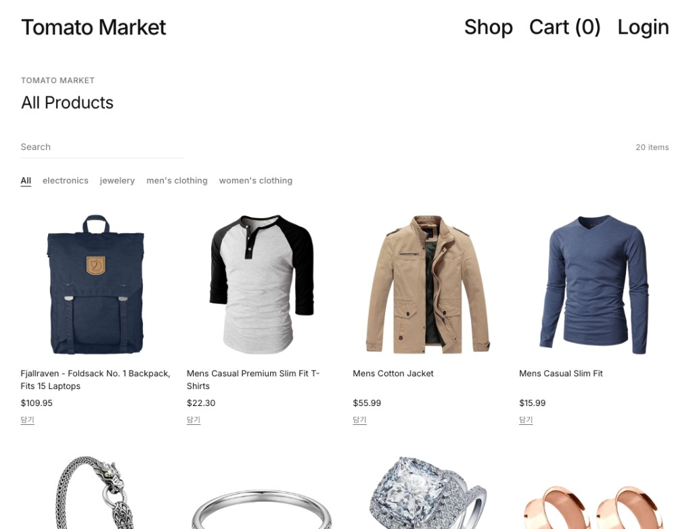
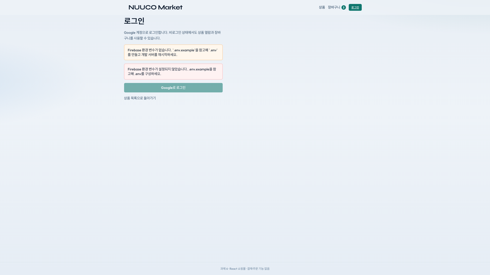
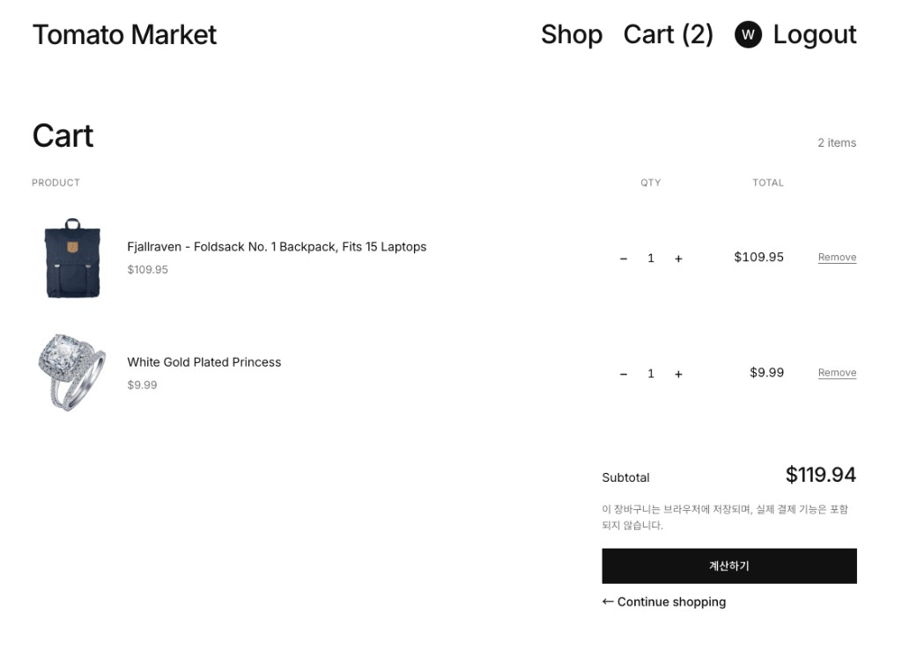
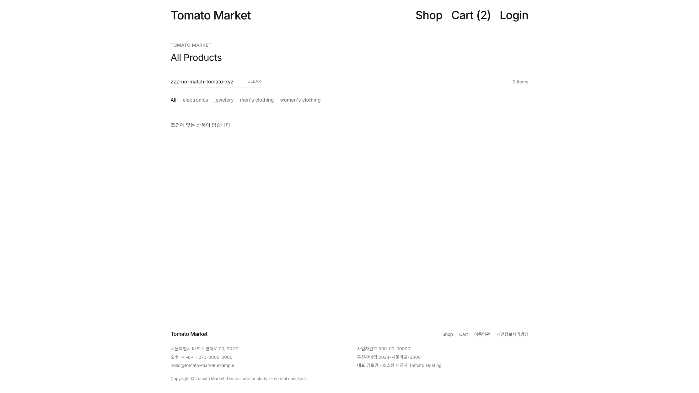

# 과제 6. React 쇼핑몰 앱 만들기 — README

## 1. 과제 소개

| 항목 | 내용 |
|---|---|
| 과정명 | AI SW 장기교육 |
| 선수 강의 | 따라하며 배우는 리액트 A-Z |
| 핵심 기술 | React, 전역 상태관리, Firebase Authentication |
| 상품 데이터 | Fake Store API 또는 기록된 mock 대체 |
| 선택 기술 | TypeScript |
| 결과 예시 | https://drive.google.com/file/d/1fUeCYpSu0H_BU154iN7t1IHM37cDo6mz/view?usp=sharing |

### 한 줄 소개

> 이 프로젝트는 **게스트·로그인 사용자**가 상품을 조회하고 Firebase로 로그인하며, 원하는 상품을 전역 장바구니에 담아 예상 총액을 확인할 수 있는 React 쇼핑몰입니다.

### 결과 예시와 다른 점

- 참고한 기능 흐름: 상품 목록 → 담기 → 전역 cart·총액 → Firebase 로그인·로그아웃
- 다르게 설계한 UI·기능: 브랜드명 **Tomato Market**, 유어마인드형 미니멀(흰 배경·큰 Inter 타이포·무카드 그리드·글라스 헤더), Google·이메일 로그인, 검색·필터·상세·LocalStorage·담기 미리보기·계산하기
- 복제하지 않은 이미지·브랜드·문구: 결과 예시의 브랜드·레이아웃·문구를 그대로 쓰지 않음

### 관련 문서

| 문서 | 내용 |
|---|---|
| [docs/01_요구사항.md](docs/01_요구사항.md) | 화면↔기능·예외 상태·테스트 |
| [docs/02_데이터구조.md](docs/02_데이터구조.md) | product / cartItem / authUser · 상태 경계 |
| [docs/03_프롬프트기록.md](docs/03_프롬프트기록.md) | AI 단계 인덱스 |
| [docs/PROMPT_LOG.md](docs/PROMPT_LOG.md) | 프롬프트 원문·채택/기각 |
| [docs/04_AI검토표.md](docs/04_AI검토표.md) | AI 결과 검토 |
| [docs/05_오류해결.md](docs/05_오류해결.md) | 오류 요약 표 |
| [docs/06_Firebase설계.md](docs/06_Firebase설계.md) | Auth·env·보안 |
| [docs/07_과제제출체크.md](docs/07_과제제출체크.md) | 필수 체크·제출 갭 |
| [docs/08_데모접속_사이트URL.md](docs/08_데모접속_사이트URL.md) | 배포 URL·접속 안내 |
| [docs/09_트러블슈팅.md](docs/09_트러블슈팅.md) | 이슈 상세 (단일 문서) |

## 2. 실행 화면

실행 캡처는 문서 하단 [실행 화면 캡처](#실행-화면-캡처)에 모아 두었습니다.

### 실시간 응시와 최종 보완 비교

| 항목 | 1시간 종료 시 | 최종 제출 시 | 보완 내용 |
|---|---|---|---|
| 데이터·상태·인증 설계 | 해당 없음(실시간 미응시) | product·cartItem·authUser 정의 | [docs/02](docs/02_데이터구조.md)·타입 파일 |
| 전역 장바구니 | 해당 없음 | Redux Toolkit cartSlice 완료 | 수량·삭제·배지·총액 |
| Firebase 인증 | 해당 없음 | Google·이메일 로그인 흐름 완료 | 실로그인·로그아웃 확인 완료 |
| 상품 API·대체 경로 | 해당 없음 | API + 8초 timeout mock 대체 | 재시도 버튼 |
| README·테스트 | 해당 없음 | 템플릿 §1~17 작성 | 캡처·오류·AI 기록 |

## 3. 구현 기능

### 필수 기능

| 기능 | 상태 | 확인 방법 | 비고 |
|---|---|---|---|
| 상품 데이터 조회 또는 mock 대체 | ☑ 완료 / □ 부분 / □ 미완료 | 홈에서 목록 표시 | `productApi.ts` |
| loading·error·empty | ☑ 완료 / □ 부분 / □ 미완료 | 로딩 문구·mock 배너·검색 0건 | HomePage |
| 상품 목록·카드 | ☑ 완료 / □ 부분 / □ 미완료 | 이름·가격·이미지·담기 | ProductCard |
| 전역 상태관리 라이브러리 | ☑ 완료 / □ 부분 / □ 미완료 | Redux DevTools/담기 후 Header 배지 | RTK |
| 장바구니 담기·목록 | ☑ 완료 / □ 부분 / □ 미완료 | `/cart` | cartSlice |
| 총액 계산 | ☑ 완료 / □ 부분 / □ 미완료 | 수기 계산과 비교 | selector |
| Firebase 로그인 | ☑ 완료 / □ 부분 / □ 미완료 | `/login` Google·이메일 로그인 | `.env` 필요 |
| 인증 초기·사용자 상태 | ☑ 완료 / □ 부분 / □ 미완료 | Login 로딩 문구 → Header `…` → 로그인/비로그인 | AuthContext |
| 로그인 오류·로그아웃 | ☑ 완료 / □ 부분 / □ 미완료 | 실패 메시지·Header 로그아웃 | useAuth |

### 권장 기능

| 기능 | 상태 | 설명 |
|---|---|---|
| 수량 변경 | ☑ 완료 / □ 미구현 | +/−, 1 이하 시 항목 제거 |
| 항목 삭제 | ☑ 완료 / □ 미구현 | 다른 항목 유지 |
| 빈 장바구니 안내 | ☑ 완료 / □ 미구현 | 빈 안내 + Continue shopping |
| API 다시 시도 | ☑ 완료 / □ 미구현 | 오류 배너 재시도 |
| 인증 로딩 UX | ☑ 완료 / □ 미구현 | loading 중 로그인 오표시 방지 |
| 로그인 전후 UI | ☑ 완료 / □ 미구현 | 비로그인: Login / 로그인: 이니셜 아바타·Logout |

추가 구현: 상품 상세(`/product/:id`) — 담기 상태 문구·장바구니 이동, 헤더 담기 미리보기, 계산하기로 cart 비우기

### 도전 기능

| 기능 | 상태 | 적용 범위·효과 |
|---|---|---|
| TypeScript | ☑ 적용 / □ 미적용 | Product·CartItem·AuthUser 및 전 구간 |
| 검색 | ☑ 적용 / □ 미적용 | 상품명, 0건 안내 |
| 카테고리 필터 | ☑ 적용 / □ 미적용 | 전체 + API 카테고리 |
| LocalStorage | ☑ 적용 / □ 미적용 | `fake-shop-cart` 저장·복원 |
| 수량 배지 | ☑ 적용 / □ 미적용 | Header 총 수량(selector) |
| 반응형·접근성 | ☑ 적용 / □ 미적용 | 모바일 그리드·focus-visible |

## 4. 상품 데이터 구조

상세 필드·규칙: [docs/02_데이터구조.md](docs/02_데이터구조.md) · 요구사항: [docs/01_요구사항.md](docs/01_요구사항.md)

- 표준 endpoint: `https://fakestoreapi.com/products`
- 실제 사용 경로: API 우선, 실패·timeout 시 mock 대체
- mock을 사용한 경우 이유: 네트워크/403/timeout 등으로 API 실패 시에도 동일 UI 유지
- 사용한 응답 필드: `id`, `title`, `price`, `image`, `category`, `description`
- 내부 product 변환 위치: `src/services/productApi.ts` → `mapApiProduct`

### `product`

| 필드 | 자료형 | 원본 필드 | 사용 위치 | 검증 |
|---|---|---|---|---|
| id | number | id | key·상세 라우트 | 중복 없음 |
| title | string | title | 카드·cart | 문자열 |
| price | number | price | 단가·총액 | Number() 변환 |
| image | string | image | 카드·상세 | onError 대체 |
| category | string | category | 필터·상세 | 빈 값 허용 |
| description | string | description | 상세 | 문자열 |

### API 상태

| 상태 | 화면 처리 |
|---|---|
| loading | 「상품을 불러오는 중입니다…」 |
| success | ProductList 그리드 |
| error | 경고 배너 + mock 목록 + 다시 시도 |
| empty (목록 0건) | 「표시할 상품이 없습니다.」 |
| empty (검색·필터 0건) | 「조건에 맞는 상품이 없습니다.」 |
| mock fallback | 오류 메시지와 함께 MOCK_PRODUCTS 표시 |

## 5. 전역 상태관리 구조

상세·상태 경계(cart=Redux, auth=Context): [docs/02_데이터구조.md](docs/02_데이터구조.md)

- 사용 라이브러리: Redux Toolkit + React Redux
- Redux Toolkit을 사용하지 않은 경우 선택 이유: (해당 없음)
- store 위치: `src/store/index.ts`
- cart slice 또는 상태 모듈: `src/store/cartSlice.ts`
- Provider 연결 위치: `src/main.tsx`
- 총액 계산 위치: `selectCartTotal` selector (state에 total 미저장)

### `cartItem`

| 필드 | 자료형 | 값의 출처 | 변경 규칙 |
|---|---|---|---|
| productId | number | product.id | 불변 |
| title | string | product.title | 불변 |
| price | number | product.price | 계산용 |
| quantity | number | 기본 1 | 1 이상, 감소 시 1 이하면 삭제 |
| image | string | product.image | 표시용 |

### action·selector

| 구분 | 이름 | 역할 | 테스트 |
|---|---|---|---|
| action | addItem | 담기·중복 시 수량+1 | 같은 상품 두 번 담기 |
| action | increase / decrease | 수량 변경 | 총액 동시 변경 |
| action | removeItem | 항목 삭제 | 다른 항목 유지 |
| action | clearCart | 계산하기로 전체 비우기 | 빈 장바구니 UI |
| selector | selectCartItems | 목록 | `/cart` |
| selector | selectCartTotal / selectCartCount | 총액·배지 | 수기 계산 |
| selector | selectLastAdded | 헤더 담기 미리보기 | 담기 직후 표시 |

### 장바구니 정책

| 항목 | 선택 |
|---|---|
| 같은 상품 재추가 | quantity + 1 |
| 최소 수량 | 1 |
| 수량 0 처리 | decrease 시 항목 삭제 |
| 로그아웃 시 cart | 유지 (게스트 허용 정책) |
| 저장 방식 | 메모리(Redux) + LocalStorage |

## 6. Firebase Authentication

설계·env·Authorized domains: [docs/06_Firebase설계.md](docs/06_Firebase설계.md)

- 로그인 방식: Google (`signInWithPopup`) + 이메일/비밀번호 (`signInWithEmailAndPassword` / `createUserWithEmailAndPassword`)
- 인증 상태 관리 위치: `AuthProvider` + `useAuth` (`onAuthStateChanged` 단일 listener)
- 로그인 성공 화면: `/`로 이동, Header에 이니셜 아바타(호버 시 닉네임) + Logout
- 로그인 실패 안내: 오류 배너 메시지
- 인증 초기 로딩: Login 「인증 상태를 확인하는 중입니다…」 / Header `…` (로딩 중 Login 오표시 방지)
- 로그아웃 처리: Header Logout → `signOut`

### `authUser`

| 필드 | 사용 | 화면 표시 | 개인정보 보호 |
|---|:---:|:---:|---|
| uid | ☑ | □ | 화면·캡처 미노출 |
| displayName | ☑ | △ | 이니셜만 표시, 툴팁·aria로 전체 이름 |
| email | ☑ | △ | displayName 없을 때 마스킹해 툴팁 |
| photoURL | ☑ | □ | 미표시 |

### 인증 흐름

```text
앱 시작
→ 인증 상태 확인(loading)
→ 로그인 또는 비로그인 화면
→ 로그인 성공·실패
→ 사용자 상태 표시
→ 로그아웃
```

정책: **비로그인에서도 상품 열람·장바구니 사용 가능**

## 7. 사용 기술

| 구분 | 기술 | 버전 | 사용 이유 |
|---|---|---|---|
| UI | React | ^19.2.7 | 컴포넌트·이벤트 |
| 전역 상태 | Redux Toolkit + React Redux | ^2.12.0 / ^9.3.0 | 전역 cart |
| 인증 | Firebase Authentication | ^12.16.0 | Google·이메일/비밀번호 로그인 |
| 상품 데이터 | Fake Store API / mock | - | 표준 경로 |
| 라우팅 | React Router | ^7.18.1 | 목록·상세·cart·login |
| 스타일 | CSS (변수·모듈형 파일) | - | 브랜드 UI |
| 언어 | TypeScript | ~6.0.2 | 타입 안전 |
| 빌드 | Vite | ^8.1.1 | 개발 서버 |
| AI 도구 | Cursor (Composer) | - | 설계·구현·검토 |

## 8. 설치·환경 변수·실행

### 요구 환경

- Node.js: 20+ (개발 환경 v25.6.1에서 확인)
- 패키지 관리자: npm
- 브라우저: Chrome 등 최신 브라우저
- Firebase 인증 제공자: Google, Email/Password
- Firebase Authorized Domain 확인: Firebase Console → Authentication → Settings → Authorized domains에 `localhost` 포함

### 설치와 실행

```bash
npm install
cp .env.example .env   # Firebase 값 입력
npm run dev
```

### `.env.example`

실제 값 대신 자리표시자만 작성합니다.

```env
VITE_FIREBASE_API_KEY=replace_with_your_value
VITE_FIREBASE_AUTH_DOMAIN=replace_with_your_value
VITE_FIREBASE_PROJECT_ID=replace_with_your_value
VITE_FIREBASE_STORAGE_BUCKET=replace_with_your_value
VITE_FIREBASE_MESSAGING_SENDER_ID=replace_with_your_value
VITE_FIREBASE_APP_ID=replace_with_your_value
```

> service account JSON, Admin SDK private key, 비밀번호, access token은 포함하지 않습니다.

### 실행 확인

1. 개발 서버가 실행됩니다.
2. 인증 초기 상태가 표시됩니다.
3. 로그인·실패 안내·로그아웃이 동작합니다. (`.env` 설정 후)
4. API 또는 mock 상품이 표시됩니다.
5. 장바구니와 총액이 전역 상태로 동작합니다.
6. console에 치명적 오류가 없습니다.

## 9. 폴더·파일 구조

```text
fake-shop/
├─ README.md
├─ AGENTS.md
├─ docs/                   # 요구사항·구조·AI·오류·제출 체크
├─ package.json
├─ vercel.json             # SPA rewrite (/cart·/login 새로고침)
├─ .env.example
├─ public/favicon.svg
├─ screenshots/
│  ├─ products.png
│  ├─ auth.png
│  ├─ cart.png
│  └─ error-empty.png      # 빈 장바구니 UI
└─ src/
   ├─ main.tsx
   ├─ App.tsx
   ├─ index.css
   ├─ constants/brand.ts
   ├─ types/
   ├─ store/
   │  ├─ index.ts
   │  ├─ cartSlice.ts
   │  └─ hooks.ts
   ├─ services/
   │  ├─ firebase.ts
   │  ├─ productApi.ts
   │  └─ mockProducts.ts
   ├─ hooks/useAuth.ts
   ├─ context/AuthContext.tsx
   ├─ components/
   ├─ pages/
   └─ utils/
      ├─ format.ts
      └─ image.ts
```

| 파일·폴더 | 역할 | 내가 수정한 내용 |
|---|---|---|
| `docs/` | 과제 산출 문서 | 01~09·PROMPT_LOG |
| `src/store/cartSlice.ts` | cart state·action·selector | 담기·수량·LocalStorage |
| `src/services/productApi.ts` | API·매핑·timeout mock | loading/error 대체 |
| `src/hooks/useAuth.ts` | Firebase 인증 | Google·이메일·listener |
| `src/pages/*` | 화면 | 홈·상세·cart·login |
| `README.md` | 제출 문서 | 템플릿 채움·docs 링크 |

## 10. 데이터·상태 흐름

```text
Fake Store API 또는 mock
→ product 변환
→ ProductList·ProductCard
→ dispatch(addItem)
→ 전역 cart state (+ LocalStorage)
→ Cart·Header 배지·selectCartTotal

Firebase Authentication
→ 인증 listener
→ 초기·로그인·비로그인·오류 UI
```

## 11. AI 활용 기록

상세 인덱스·원문: [docs/03_프롬프트기록.md](docs/03_프롬프트기록.md) · [docs/PROMPT_LOG.md](docs/PROMPT_LOG.md)  
(아래 표는 요약. 단계 전체는 docs/03)

| 번호 | 목적 | AI 도구 | 프롬프트 요약 | 결과 활용 | 내가 수정한 부분 |
|---:|---|---|---|---|---|
| 1 | 요구사항·설계 | Cursor | 과제 문서 분석, DB/Redux 설명, 계획 수립 | 구현 범위 확정 | Google 로그인·게스트 cart 정책 확정 |
| 2 | Redux 상태 | Cursor | cartSlice·selector·LocalStorage | store 구현 | 순환 import 제거 |
| 3 | Firebase 인증 | Cursor | AuthProvider·Google popup | useAuth 구현 | `.env` 미설정 UX |
| 4 | 상품 API | Cursor | fetch·mock·loading | productApi | 8초 AbortController timeout |
| 5 | 통합 검토·오류 | Cursor | 빌드·스크린샷·README | 제출물 | README 템플릿 전항 기입 |
| 6 | docs 체계 | Cursor | 설계·AI·오류·제출 문서 정리 | docs/01~09 | 채택/기각·트러블슈팅 정리 |

### 대표 프롬프트 1

```text
React 쇼핑몰 과제를 시작합니다.
공식 요구사항: React, Redux Toolkit, Firebase Authentication, Fake Store API, TypeScript 선택
제외: 결제·주문·배송·회원 등급·실제 개인정보
요청: 필수·권장·도전 구분, 데이터·상태·인증·API·UI 순서, 아직 코드 작성 금지
```

### 대표 프롬프트 2

```text
확정한 장바구니 설계를 Redux Toolkit으로 기능 단위 구현해줘.
순서: store → Provider → cart slice → add → selectors → 수량·삭제
조건: 단계별 변경, total은 selector, LocalStorage 동기화, 전체 재작성 금지
```

## 12. AI 생성 결과 검토

상세: [docs/04_AI검토표.md](docs/04_AI검토표.md)

| 항목 | 결과 | 수정 |
|---|---|---|
| 전역 상태 사용 | ☑ 통과 / □ 보완 | - |
| action·reducer·selector | ☑ 통과 / □ 보완 | RootState 순환 import 제거 |
| Firebase 실제 인증 | ☑ 통과 / □ 보완 | 실로그인·로그아웃 확인 |
| 인증 초기·오류·로그아웃 | ☑ 통과 / □ 보완 | 미설정 시 안내 표시 |
| API loading·error·empty | ☑ 통과 / □ 보완 | timeout mock 추가 |
| 총액·수량 | ☑ 통과 / □ 보완 | 109.95+22.30=132.25 확인 |
| 비밀정보·개인정보 | ☑ 통과 / □ 보완 | `.env` gitignore |
| 과도한 구현 | ☑ 통과 / □ 보완 | 결제·DB 실저장 없음 |

## 13. 테스트 기록

시나리오 요약: [docs/01_요구사항.md](docs/01_요구사항.md) §6 · 제출 갭: [docs/07_과제제출체크.md](docs/07_과제제출체크.md)

| 번호 | 시나리오 | 기대 결과 | 실제 결과 | 통과 |
|---:|---|---|---|:---:|
| 1 | 최초 실행 | 인증·상품 loading | 로딩 후 목록 표시 | ☑ |
| 2 | 로그인 성공 | 사용자 상태 | Google·이메일 로그인·이니셜 아바타·Logout 확인 | ☑ |
| 3 | 로그인 실패 | 오류 안내 | 미설정 시 안내·버튼 비활성 | ☑ |
| 4 | 로그아웃 | 비로그인 상태 | Logout 후 Login 링크 복귀 확인 | ☑ |
| 5 | API 성공 | 상품 목록 | Fake Store 20개 표시 | ☑ |
| 6 | API 실패·대체 | 오류·mock | timeout/ mock 경로 구현 | ☑ |
| 7 | 상품 2개 담기 | cart·total 일치 | $132.25 | ☑ |
| 8 | 빈 cart | 빈 안내 UI | `0 items` + 「장바구니가 비어 있습니다.」 | ☑ |

## 14. 오류 해결 기록

요약: [docs/05_오류해결.md](docs/05_오류해결.md)(전체 7건) · 상세: [docs/09_트러블슈팅.md](docs/09_트러블슈팅.md)

| 번호 | 영역 | 오류 메시지 | 원인 | 수정 | 재실행 |
|---:|---|---|---|---|---|
| 1 | API | 상품 로딩이 오래 지속 | 브라우저에서 API 응답 지연 | `AbortController` 8초 timeout 후 mock | 목록·mock 배너 확인 |
| 2 | Redux | (설계) RootState 순환 import | cartSlice ↔ store 상호 import | CartRootState 로컬 타입 사용 | `npm run build` 성공 |
| 3 | fetch/LS/auth | 레이스·persist·status 모순 | cleanup·가드 부재 | abort·persist 가드·listener 전담 | UI 일관 |
| 4 | Firebase | COOP / `window.closed` 콘솔 | popup + COOP | 치명 아님, Header로 성공 확인 | 로그인 정상 |
| 5 | 배포 | `/cart`·`/login` 새로고침 404 | SPA 경로 미 rewrite | `vercel.json` rewrite | 배포 URL 새로고침 OK |

## 15. 보안·개인정보·저작권

운영·env·도메인: [docs/06_Firebase설계.md](docs/06_Firebase설계.md)

| 항목 | 확인 |
|---|:---:|
| `.env` 실제 값·service account를 커밋하지 않았습니다. | ☑ |
| 비밀번호·토큰·Admin private key가 없습니다. | ☑ |
| 실제 이메일·UID·주소·전화번호가 캡처에 없습니다. | ☑ |
| 실제 결제·주문·배송·회원 등급이 없습니다. | ☑ |
| 결과 예시를 그대로 복제하지 않았습니다. | ☑ |
| 이미지·브랜드·문구 사용 범위를 확인했습니다. | ☑ |
| 레포·Drive·배포 링크 권한을 확인했습니다. | ☑ |

### 외부 자료

| 자료 | 출처 | 사용 범위 |
|---|---|---|
| Fake Store API | https://fakestoreapi.com/products | 상품 데이터 실습 |
| 결과 예시 | https://drive.google.com/file/d/1fUeCYpSu0H_BU154iN7t1IHM37cDo6mz/view?usp=sharing | 기능 흐름 참고 |
| Google Fonts | Inter, Noto Sans KR | UI 타이포 |

## 16. 배운 점·한계·다음 개선

1. 장바구니는 DB가 아니라 Redux 전역 상태이며, 새로고침 유지는 LocalStorage로 분리한다.
2. Firebase Auth와 cart 상태를 결합하지 않고 listener·store 소유 위치를 나눈다.
3. API 실패를 UI에서 멈추지 않고 mock·재시도로 이어가게 하는 것이 과제 핵심이다.

### JavaScript 또는 TypeScript

- 사용 언어: TypeScript
- TypeScript 적용 범위: types·store·services·hooks·pages·components
- 정의한 타입: `Product`, `CartItem`, `AuthUser`, `AuthStatus`
- 다음 보완: Firestore cart 동기화 실구현(선택)

### 알려진 문제

- 미완료 기능: (없음 — 필수·권장·도전 구현 완료)
- 다른 환경 문제: Fake Store API가 느리거나 차단되면 mock으로 전환
- Firebase 설정 주의: Authorized domains에 localhost(및 배포 도메인), Web API key만 사용

| 한계 | 원인 | 다음 개선 | 우선순위 |
|---|---|---|---|
| 사용자별 cart 클라우드 미동기화 | 과제상 실저장 비필수 | 아래 Firestore 설계 구현 | 중 |
| 배포 후 Google 로그인 | Authorized domains 미추가 시 실패 | Firebase에 `tomato-market-one.vercel.app` 등록 | 상 |

### 사용자별 cart 저장 설계(도전·미구현)

```text
경로: users/{uid}/cart/items/{productId}
필드: productId, title, price, quantity, updatedAt
규칙 초안:
  allow read, write: if request.auth != null && request.auth.uid == userId;
현재는 LocalStorage만 사용 — 개인정보·주문 저장 금지 범위 준수
```

## 17. 제출 정보

데모·접속: [docs/08_데모접속_사이트URL.md](docs/08_데모접속_사이트URL.md) · 제출 체크: [docs/07_과제제출체크.md](docs/07_과제제출체크.md)

| 항목 | 링크·설명 |
|---|---|
| 결과물 레포 URL | https://github.com/nuuco/fake-shop |
| 실행·배포 URL | https://tomato-market-one.vercel.app/ |
| 제출 폼 | https://goor.me/aiswwork1 |

## 실행 화면 캡처

| 화면 | 설명 | 캡처 |
|---|---|---|
| 상품 목록 | Fake Store API 목록, 검색·카테고리 필터, 담기 |  |
| 로그인·인증 | 이메일·비밀번호 + Google 로그인 |  |
| 장바구니·총액 | 수량·삭제·총액·계산하기 (로그인 상태) |  |
| 빈 장바구니 | 빈 cart 안내·Continue shopping (`error-empty.png` 파일명 유지) |  |
